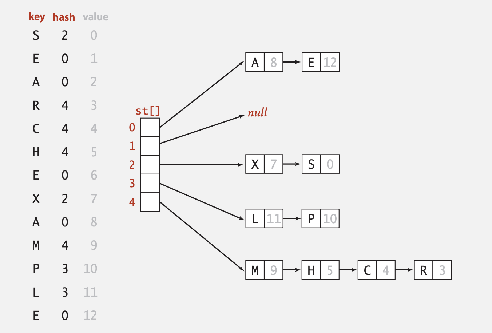

# Hash

散列（hashing）是电脑科学中一种对资料的处理方法，通过某种特定的函数/算法（称为散列函数/算法）将要检索的项与用来检索的索引（称为散列，或者散列值）关联起来，生成一种便于搜索的数据结构（称为散列表）。

[TOC]

## Hash Function

建立一个映射到哈希表中的索引。一个好的**hash function**应该满足如下要求：

1. Efficiently computable. 
2. Each table index equally likely for each key

## Hash Table

若关键字为`k`，则其值存放在`f(k)`的存储位置上。由此，不需比较便可直接取得所查记录。称这个对应关系f为散列函数，按这个思想建立的表为散列表。

### 冲突

对不同的关键字可能得到同一散列地址，即`k1≠k2`，而`f(k1)=f(k2)`，这种现象称为冲突。

### 解决冲突的方法：

#### 线性探测法

散列到同一位置的元素，在这个位置上添加一条链表，将元素放置到链表上。


   

   **优点：** 
   1）易于实现。 
   2）哈希表永远不会填满，我们总是可以向链中添加更多元素。 
   3）对散列函数或负载因子较不敏感。 
   4）通常在不知道可以插入或删除多少个密钥和多长时间一次的情况下使用。 

   **缺点：** 
   1）链接的缓存性能不佳，因为密钥是使用链接列表存储的。开放式寻址提供了更好的缓存性能，因为所有内容都存储在同一张表中。 
   2）空间浪费（从不使用哈希表的某些部分） 
   3）如果链变长，那么在最坏的情况下搜索时间可能变为O（n）。 
   4）使用额外的空间进行链接。 

```  c++
class MyHashSet {
private:
    vector<list<int>> data;
    static const int base = 769;
    static int hash(int key) {
        return key % base;
    }
public:
    /** Initialize your data structure here. */
    MyHashSet(): data(base) {}
    
    void add(int key) {
        int h = hash(key);
        for (auto it = data[h].begin(); it != data[h].end(); it++) {
            if ((*it) == key) {
                return;
            }
        }
        data[h].push_back(key);
    }
    
    void remove(int key) {
        int h = hash(key);
        for (auto it = data[h].begin(); it != data[h].end(); it++) {
            if ((*it) == key) {
                data[h].erase(it);
                return;
            }
        }
    }
    
    /** Returns true if this set contains the specified element */
    bool contains(int key) {
        int h = hash(key);
        for (auto it = data[h].begin(); it != data[h].end(); it++) {
            if ((*it) == key) {
                return true;
            }
        }
        return false;
    }
};
```


#### 开放定址法

与单独的链接一样，开放式寻址是一种处理冲突的方法。在开放式寻址中，所有元素都存储在哈希表本身中。因此，**表的大小在任何时候都必须大于或等于键的总数**（请注意，如果需要，我们可以通过复制旧数据来增加表的大小）。**大小为M的数组保存N个键值对，其中M>N**。

插入：继续探测，直到找到一个空插槽。找到空插槽后，插入k。 

搜索：继续探测，直到插槽的密钥不等于k或到达空插槽为止。 

删除：如果我们只是删除一个键，则搜索可能会失败。因此，已删除密钥的插槽特别标记为“已删除”。 插入内容可以在已删除的广告位中插入项目，但搜索不会在已删除的广告位中停止。 

1. 线性探测

   ```
   If slot hash(x) % S is full, then we try (hash(x) + 1) % S
   If (hash(x) + 1) % S is also full, then we try (hash(x) + 2) % S
   ```

2. 二次探测

   ```
   let hash(x) be the slot index computed using hash function.  
   If slot hash(x) % S is full, then we try (hash(x) + 1*1) % S
   If (hash(x) + 1*1) % S is also full, then we try (hash(x) + 2*2) % S
   ```

3. 双重哈希

   ```
   let hash(x) be the slot index computed using hash function.  
   If slot hash(x) % S is full, then we try (hash(x) + 1*hash2(x)) % S
   If (hash(x) + 1*hash2(x)) % S is also full, then we try (hash(x) + 2*hash2(x)) % S
   If (hash(x) + 2*hash2(x)) % S is also full, then we try (hash(x) + 3*hash2(x)) % S
   ```

``` c++
class MyHashSet {
public:
    /** Initialize your data structure here. */
    MyHashSet() {
        h.resize(m, -1);
        
    }
    int hash(int key)
    {
        return key%m;
    }
    
    void add(int key) {
        int i ;
        for(i = hash(key); h[i] != -1; i=(i+1)%m){
            if(h[i] == key) return;
        }
        h[i] = key;
        n++;
        
    }
    
    void remove(int key) {
        for(int i = hash(key); h[i] != -1; i = (i+1)%m){
            if(h[i] == key) h[i] = -1;
        }
        n--;
    }
    
    /** Returns true if this set contains the specified element */
    bool contains(int key) {
        for(int i = hash(key); h[i] != -1; i = (i+1)%m){
            if(h[i] == key) return true;
        }
        return false;
    }
private:
    int m = 1000000;
    int n=0;
    vector<int> h;

};
```

