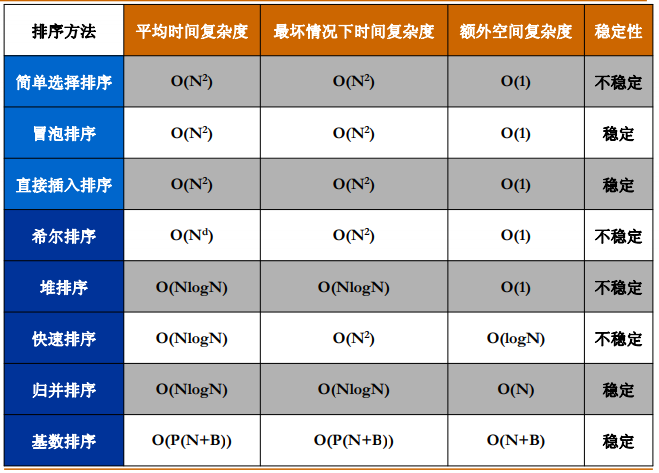

# 排序

交换两个数

```c
void swap(int *xp, int *yp)
{
    int temp = *xp;
    *xp = *yp;
    *yp = temp;
}
```

## 冒泡排序

```c
int bubble_sort(int arr[], int n)
{
    int i, j;
    for(i = 0; i< n-1 ;i++)
    {
        for(j =0; j< n-i-1; j++)
        {
            if(arr[j] > arr[j+1])
            {
                swap(&arr[j], &arr[j+1])；
            }
        }
    }
}
```

## 插入排序

```c
int insertion_sort(int arr[], int n)
{
    int i, j, temp;
    for(i = 1; i < n; i++)
    {
        temp = arr[i];
        for(j = i; j>0 && arr[j-1]>temp; j--)
        {
            arr[j] = arr[j-1]; //元素依次向后移动
        }
        arr[j] = temp;
    }
}
```

## 选择排序

首先在未排序序列中找到最小（大）元素，存放到排序序列的起始位置，然后，再从剩余未排序元素中继续寻找最小（大）元素，然后放到已排序序列的末尾

```c
int select_sort(int arr[], int n)
{
    int i, j, min_index;
    for(i = 0; i<n-1; i++)
    {
        min_index = i;
        for(j = i+1；j < n;j++)
        {
            if(arr[j] < arr[min_index])
            {
                min_index = j;
            }
        }
        swap(&arr[j], arr[index]);
    }
}
```

## 希尔排序

```c
    int shell_sort(int arr[], int n)
    {
        int i, j, increment, temp;
        for(increment = n/2; increment > 0; increment /= 2)
        {
            for(i = increment; i < n; i++)
            {
                temp = arr[i];
                for(j = i; j >= increment && arr[j-increment] > temp; j -= increment)
                {
                    arr[j] = arr[j-increment];
                }
                arr[j] = temp;
            }
        }
    }
```

## 堆排序

```c
void PercDown( ElementType A[], int p, int N )
{
    int Parent, Child;
    ElementType X;
    X = A[p]; /* 取出根结点存放的值 */
    for( Parent=p; (Parent*2+1)<N; Parent=Child ) 
    {
        Child = Parent * 2 + 1;
        if( (Child!=N-1) && (A[Child]<A[Child+1]) )
            Child++;  /* Child指向左右子结点的较大者 */
        if( X >= A[Child] ) break; /* 找到了合适位置 */
        else  /* 下滤X */
            A[Parent] = A[Child];
    }
    A[Parent] = X;
}

void HeapSort( ElementType A[], int N ) 
{ /* 堆排序 */
     int i;
     for ( i=N/2-1; i>=0; i-- )/* 建立最大堆 */
         PercDown( A, i, N );
     for ( i=N-1; i>0; i-- ) 
     {
         /* 删除最大堆顶 */
         Swap( &A[0], &A[i] );
         PercDown( A, 0, i );
     }
}
```

## 归并排序

```c
void Merge_pass( ElementType A[], ElementType TmpA[], int N, int length )
{ /* 两两归并相邻有序子列 */
     int i, j;
     for ( i=0; i <= N-2*length; i += 2*length )
         Merge( A, TmpA, i, i+length, i+2*length-1 );
     if ( i+length < N ) /* 归并最后2个子列*/
         Merge( A, TmpA, i, i+length, N-1);
     else /* 最后只剩1个子列*/
         for ( j = i; j < N; j++ ) TmpA[j] = A[j];
}

void Merge_Sort( ElementType A[], int N )
{
     int length;
     ElementType *TmpA;
     length = 1; /* 初始化子序列长度*/
     TmpA = malloc( N * sizeof( ElementType ) );
     if ( TmpA != NULL ) 
     {
          while( length < N ) {
              Merge_pass( A, TmpA, N, length );
              length *= 2;
              Merge_pass( TmpA, A, N, length );
              length *= 2;
          }
          free( TmpA );
     }
     else printf( "空间不足" );
}


FORT
HEADCMD()
HEADCMD()

HEADCMD()


//递归版本
void merge_sort_recursive(int arr[], int reg[], int start, int end) 
{
    if (start >= end)
        return;
    int len = end - start, mid = (len >> 1) + start;
    int start1 = start, end1 = mid;
    int start2 = mid + 1, end2 = end;
    merge_sort_recursive(arr, reg, start1, end1);
    merge_sort_recursive(arr, reg, start2, end2);
    int k = start;
    while (start1 <= end1 && start2 <= end2)
        reg[k++] = arr[start1] < arr[start2] ? arr[start1++] : arr[start2++];
    while (start1 <= end1)
        reg[k++] = arr[start1++];
    while (start2 <= end2)
        reg[k++] = arr[start2++];
    for (k = start; k <= end; k++)
        arr[k] = reg[k];
}
void merge_sort(int arr[], const int len) 
{
    int reg[len];
    merge_sort_recursive(arr, reg, 0, len - 1);
}
```

## 快速排序

```c
int Median3(int arr[], int Left, int Right)
{
    int Center = (Left+Right) / 2;
    if(arr[Left] > arr[Center])
        swap(&arr[Left], &arr[Center]);
    if(arr[Left] > arr[Right])
        swqp(&arr[Left], &arr[Right]);
    if(arr[Center] > arr[Right])
        swap(&arr[Center], &arr[Right-1]);
    swap(&arr[Center, &arr[Right-1]]);

    return arr[Right-1];
}

#define Cutoff (3)

void Qsort(int arr[], int Left, int Right)
{
    int Pivot, Low, high;
    if(Cutoff <= Right-Left)
    {
        Pivo = median3(arr, Left, Right);
        Low = Left; High = Right - 1;
        while(1)
        {
            while(arr[++Low] < Prvot);
            while(arr[--High] > Prvot);
            if(Low < High)
                swqp(&arr[Low], &arr[High]);
            else
                break;
        }
        swap(&arr[Low], &arr[Right - 1]);
        Qsort(arr, Left, Low-1);
        Qsort(arr, Low+1, Right);
    }
    else Insertion_sort(Arr+Left, Right-Left+1);
}
void QuickSort(int arr[], int n)
{
    Qsort(arr, 0, n-1);
}
```

## 算法比较



